# 🎩 6: Build a Harry Potter Movie Quiz

| **Project Goal**            | Build a Harry Potter Movie Quiz                                                                                                                                   |
| --------------------------- | ------------------------------------------------------------------------------------------------------------------------------------------------------------------------------------------------ |
| **What you’ll learn**       | Basics about Vue components, how data binding is done in Vue, and how to perform simple REST API calls                                                                                             |
| **Tools you’ll need**       | Modern browser like chrome and access to [CodeSandbox](https://codesandbox.io)
| **Time needed to complete** | 1.5 to 3+ hours (don't stress) |
| **Just want to try the app?** | [Code Sandbox link](https://codesandbox.io/s/ws-harry-potter-quiz-55ygd)

# Acknowledgment

The workshop idea is inspired by [Dmytro Barylo](https://www.linkedin.com/in/dmytrobarylo/) from Ukraine who made the [Harry Potter Movie Quiz](https://madewithvuejs.com/harry-potter-movies-quiz). We would like to take this opportunity to thank Dmytro Barylo for the great idea on which basis we actually developed this workshop.

# Instructions

## Step 1: Setting up the Vue App with CodeSandbox

Create a new sandbox Vue project by going to CodeSandbox and clicking on the “Create Sandbox” box.
The options for which kind of sandbox you want to have will appear.

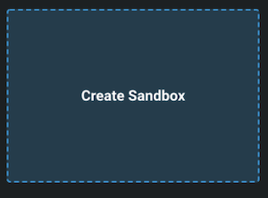

There, choose Vue as the basis for your sandbox. The instant IDE will then set up a base Vue project for you.

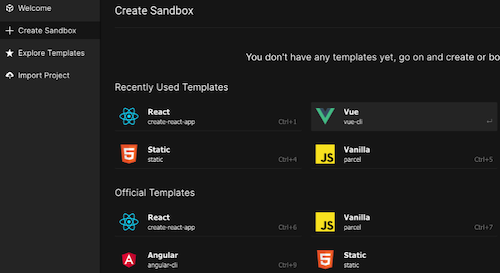

Once the IDE finished the setup, it opens your project in the editor.

On the left side, you'll see all generated files in the navigation bar and dependencies the project has so far.
Don’t worry about the dependencies, we are going to explain them later on.

On the right side of the navigation bar, you'll find the editor. Here you can code and see all your changes instantly in the preview to the right.

If you see the project boilerplate, it'll have content so far. It contains a lot of references provided by Vue.js itself to get help.

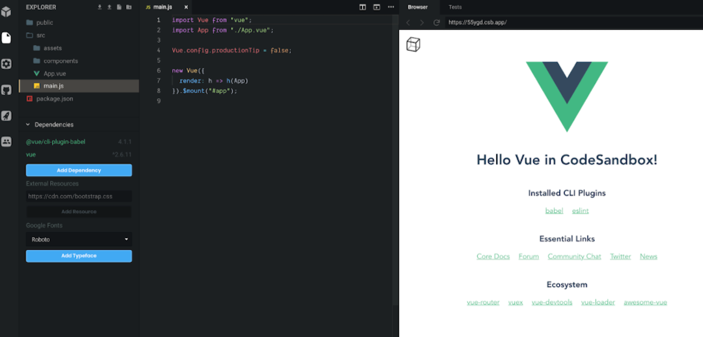


The `main.js` is the entry point for the application start.

```javascript
new Vue({
  render: h => h(App)
}).$mount("#app");
```

Here you can see that a Vue project is initialized and a Vue instance is generated by invoking the Vue constructor, `new Vue({/* options go here */})`. Using `$mount([elementOrSelector])`, the Vue instance is mounted to the `#app` element.

Every Vue application, no matter how big or small, starts with the root Vue instance.

For more information check out:
- [https://codingexplained.com/coding/front-end/vue-js/mounting-templates-dynamically](https://codingexplained.com/coding/front-end/vue-js/mounting-templates-dynamically)
- [https://vuejs.org/v2/guide/instance.html](https://vuejs.org/v2/guide/instance.html)

In the first lines of the `main.js` you can find some *imports*.
The first one imports the Vue module and the second one is the very first component we will use - it is the App *component*.

```javascript
import Vue from "vue";
import App from "./App.vue";
```

The App.vue file actually contains the ID-Selector `#app` which we'll use to mount the Vue application.

```javascript
<template>
  <div id="app">
    
    <HelloWorld msg="Hello Vue in CodeSandbox!" />
  </div>
</template>
```

### Achievement

At this point, your application should look similar to the following:

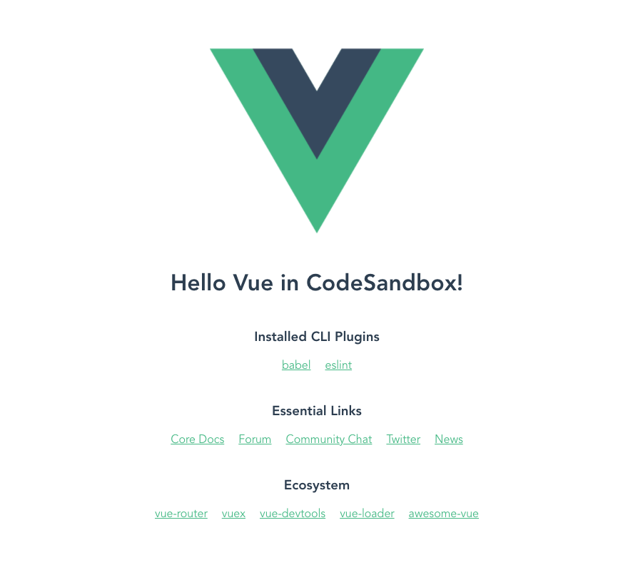


## Step 2: Create your first Vue component: "Quiz.vue"

Now we are going to create our first component in Vue. All components are also called Vue instances.

Our Vue project actually provides a folder structure which is similar to many other JavaScript frameworks. All Vue components are stored in the components folder. There you can also find the **HelloWorld.vue** component which contains all the helping text.

Let's create a quiz component **Quiz.vue** inside the components folder. Right-click on the folder in CodeSandbox to create a new file.

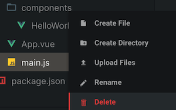

The file will be empty so far.

Normally Vue components contain:
- A template
- A script
- A style section

The smallest Vue component looks like this. Copy this snippet and paste it into your new file:

```html
<template>
  <div></div>
</template>

<script>export default {};</script>

<style></style>
```

This doesn’t provide any meaningful output, but let's put some text within the `<div>` containers, and see when we are using it what it will output on the screen.

```html
<template>
  <div>Quiz</div>
</template>
```

Now, we'll include a brand new component in the App.vue.

To use our Quiz component some steps are needed. First we have to import the component within the script section in **App.vue**. Replace the import of `HelloWorld` with this line:

```javascript
import Quiz from "./components/Quiz.vue";
```

After that, the Quiz component has to be registered within **App.vue**, which is done by adding the imported Quiz to the App components options. Replace `HelloWorld` in the components array with `Quiz`:

```javascript
components: {
    Quiz
}
```

::: tip 💡
This above is the easiest way to import a component. It will map your component Quiz to the component element `<Quiz />`. But is also possible to register the component with more settings. E.g. With a custom name or key property for the component.

```javascript
components: {
    'quiz': Quiz
}
```
:::

The last thing to do is to add the component element `<Quiz />` in the template. You can remove the logo. Your template in `App.vue` now looks like this:

```html
<template>
  <div id="app">
    <Quiz/>
  </div>
</template>
```

At this point you can delete the <HelloWorld> component.

### Styling the Quiz

Before the Quiz starts, we need a welcome view displayed to the user.
In the **Quiz.vue** template section we'll remove the previous content, and place a picture, a title and a link via HTML, which finally will start the quiz.

```html
<div>
    
    <h1 class="quiz-heading">How Well Do You Know the Harry Potter Movies?</h1>
    <button class="quiz-button">Start Quiz</button>
</div>
```

::: tip 💡
Feeling stylish? For more styling you can use the style section of any component and write your CSS.
:::

Within **App.vue**, set some general CSS styling by overwriting the style block:

```html
/* App.vue */
<style>
* {
  box-sizing: border-box;
}
html {
  height: 100%;
}
body {
  height: 100%;
  background: #020815; /* Black */
  color: #eee; /* Gray */
}

#app {
  font-family: "Avenir", Helvetica, Arial, sans-serif;
  -webkit-font-smoothing: antialiased;
  -moz-osx-font-smoothing: grayscale;
  text-align: center;
  margin-top: 60px;
}
</style>
```

In **Quiz.vue**, add some more styles. Note, you add the `scoped` element to the `<style>` tag when you want particular styles limited to one component.

```html
/* Quiz.vue */
<style scoped>
.quiz-heading {
  margin: -40px 0 30px;
  font-size: 30px;
  text-shadow: 1px 1px 2px #020815;
  line-height: 1.2;
}

.quiz-button {
  color: #eee; /* Gray */
  text-decoration: none;
  cursor: pointer;
  display: inline-block;
  padding: 10px 30px;
  border: 1px solid rgba(238, 238, 238, 0.3);
  background: none;
  transition: border-color 0.5s;
}
.quiz-button:hover {
  border-color: #eee; /* Gray */
}
</style>
```
### Binding an Action

When you click on the button "Start Quiz" to start the quiz, nothing happens.
In order to make something happen when the link is clicked, we need to bind an action to the button.

This can be achieved by adding the shorthand event modifier `@click` to the button inside **Quiz.vue's** `<template>` section.

```javascript
<button class="quiz-button" @click="initQuizStage">Start Quiz</button>
```

::: tip 💡
You can read more about Vue Modifiers here: [https://vuejs.org/v2/guide/events.html#Event-Modifiers](https://vuejs.org/v2/guide/events.html#Event-Modifiers)

And read about Vue Shorthands here: [https://vuejs.org/v2/guide/syntax.html#Shorthands](https://vuejs.org/v2/guide/syntax.html#Shorthands)
:::

This shorthand event modifier contains `initQuizStage` as a value, which is expected to be a method for Vue. This method will be called when a user clicks the button.
Therefore we are going to define a method with the same name in the `<script>` section of our component:

```javascript
// Quiz.vue
<script>
  export default {
    name: 'quiz',
    methods: {
      initQuizStage() {
        console.log("Start the quiz...");
      }
    }
  };
</script>
```

This method only prints “Start the quiz…” to the console. Before moving on and implementing the `initQuizStage` we need more data. We need the movie titles of all Harry Potter movies as well as the data for quiz questions.

Next, we're going to provide movie titles for our Quiz component.
Providing data to child components can be done with so-called `props` in Vue.
Props are custom attributes you can register on a component to be able to pass data to them from a parent component. A value can be passed to a prop attribute, which becomes a property on that component instance.

::: tip 💡
You can read more about Vue Props here: [https://vuejs.org/v2/guide/components.html#Passing-Data-to-Child-Components-with-Props](https://vuejs.org/v2/guide/components.html#Passing-Data-to-Child-Components-with-Props)
:::

### Adding Data

In **App.vue** let's extend the quiz element with a props attribute called “movies” and provide it with movie data, which you get from the `data()` method. With the colon in front of the prop name, you are telling Vue that the value inside the brackets is not just a string but a variable, which in this case is an array. Add the data method after the components property; don't forget to add a comma after the last parenthesis of components:

```html
<!-- App.vue -->
<template>
  <div id="app">
    <Quiz :movies="movies"/>
  </div>
</template>
```

```javascript
/* App.vue */
<script>
  export default {
    // ...
    data() {
      return {
        movies: [
          "Harry Potter and the Philosopher's Stone",
          "Harry Potter and the Chamber of Secrets",
          "Harry Potter and the Prisoner of Azkaban",
          "Harry Potter and the Goblet of Fire",
          "Harry Potter and the Order of the Phoenix",
          "Harry Potter and the Half-Blood Prince",
          "Harry Potter and the Deathly Hallows - Part 1",
          "Harry Potter and the Deathly Hallows - Part 2",
        ]
      };
    }
  }
  // ...
```

If you provide a prop to a component, the receiving component has to define that property on the other side before you can use it. This is done by introducing the prop in the `props: {}` section inside **Quiz.vue**. Add the props right after `export default {`:

```html
<!-- Quiz.vue -->
<script>
  export default {
    props: {
      movies: {
        type: Array,
        required: true
      }
    },
  // ...
</script>
```

To see the movie list, we can use a simple list and iterate over the entries of movies. Add this snippet in the template area of **Quiz.vue** under the button:

```html
<!-- Quiz.vue -->
<ul>
    <li v-for="movie in movies" :key="movie">{{ movie }}</li>
</ul>
```

The `v-for` directive tells Vue to iterate over the values in movies and to repeat the `<li>` element with each value provided during each iteration.

::: tip 💡
You can read more about Vue Directives here: [https://vuejs.org/v2/guide/syntax.html#Directives](https://vuejs.org/v2/guide/syntax.html#Directives)
:::

:::v-pre
`{{ movie }}` is the most basic form of data binding called text interpolation using the “Mustache” syntax (double curly braces). The mustache tag will be replaced with movie names, which are saved in the property movies (which we defined earlier). It will also be updated whenever the component's movies property changes.
:::

::: tip 💡
You can read more about Vue Text Interpolation here: [https://vuejs.org/v2/guide/syntax.html#Interpolations](https://vuejs.org/v2/guide/syntax.html#Interpolations)
:::

### Toggling Elements

Let’s ensure that the part with the printed movies list is only shown when `initQuizStage` is clicked. This can be achieved by using the `stage` computed property and with the `v-if` directive in the template. The `v-if` directive validates the expression of its content. When it is true, the component is rendered and shown, if false, it is not rendered.

::: tip 💡
You can read more about Vue Computed Properties here: [https://vuejs.org/v2/guide/computed.html#Computed-Properties](https://vuejs.org/v2/guide/computed.html#Computed-Properties)
:::


```html
<!-- Quiz.vue -->
<template>
<!--image and button go here--->
  <ul class="quiz-choices" v-if="stage==='quiz'">
   <li v-for="movie in movies" :key="movie">{{ movie }}</li>
  </ul>
<template>
```
The **Quiz.vue** script block should look like this:

```javascript
/* Quiz.vue  */
<script>
  export default {
    props: {
      movies: {
        type: Array,
        required: true
      }
    },
    data() {
      return {
        currentQuestionNumber: 0
      };
    },
    computed: {
      stage() {
          return this.currentQuestionNumber === 0 ? 'welcome' : 'quiz';
      }
    },
    methods: {
      initQuizStage() {
        this.currentQuestionNumber = 1;
    }
  };
</script>
```

Also let's ensure that the “Start Quiz” button disappears and the list of movies appears when the Quiz is started. We can again use the `stage` property for it.

```html
<button class="quiz-button" v-if="stage==='welcome'" @click="initQuizStage">Start Quiz</button>
```

### Achievement

At the end of step 2, your application should look like this:


## Step 3: Using the Quiz data

Besides the movie data, we also need to show quiz data with a movie clip and the choices of which movie it is.

We'll get this data from a JSON (Javascript Object Notation) file.
JSON is the description of an object in a more human readable way. It is mainly used to transfer information between systems.

::: tip 💡
You can read more about JSON here:
- [https://en.wikipedia.org/wiki/JSON](https://en.wikipedia.org/wiki/JSON)
- [https://developer.mozilla.org/en-US/docs/Web/JavaScript/Reference/Global_Objects/JSON](https://developer.mozilla.org/en-US/docs/Web/JavaScript/Reference/Global_Objects/JSON)
:::

The JSON contains a list (an array) of questions. Each question contains 4 different numbers, which matches to the movies we are going to provide as labels to the buttons of answer choices. It also contains the correct answer and furthermore the movie scene as link to the giphy image. The quiz involves guessing which movie the giphy image belongs to.

The JSON structure we'll use looks like this, but we're going to load it from an external url:


```json
{
  "questions": [
    {
      "correct": 3,
      "answers": [2, 3, 4, 5],
      "img": "https://media1.giphy.com/media/26BRzozg4TCBXv6QU/giphy.gif"
    },
    ...
    {
      "correct": 4,
      "answers": [2, 4, 3, 5],
      "img": "https://media2.giphy.com/media/Zl1fSRaVDsnxS/giphy.gif"
    },
    {
      "correct": 5,
      "answers": [5, 6, 4, 3],
      "img": "https://media2.giphy.com/media/3VwZN7OxJ1GMg/giphy.gif"
    }
  ]
}

```

::: tip 💡
To learn more about data primitives, like string, numbers and arrays, which are useful to understand the JSON structure better, we recommend Lydia Hallie's excellent explanation: [https://www.theavocoder.com/complete-javascript/2018/12/18/primitive-data-types](https://www.theavocoder.com/complete-javascript/2018/12/18/primitive-data-types)
:::

To load these questions we're going to provide the Quiz component with a `questions-url` prop.

The fetching magic will happen via the `mounted()` method of our Quiz component. The `mounted()` method is a `lifecycle hook`, which is called after the instance has been mounted.

::: tip 💡
You can read more about Vue's `Mounted` lifecycle hook here: [https://vuejs.org/v2/api/#mounted](https://vuejs.org/v2/api/#mounted)
:::

Edit the template in **App.vue** to create this prop and pass it to **Quiz.vue**:

```html
<!-- App.vue -->
<quiz :movies="movies" questions-url="https://api.jsonbin.io/b/5e3f0514f47af813bad11ac5"/>
```
Then in **Quiz.vue** add the prop, as well as a `questions` array in `data` and the mounted hook. Be careful to add the `mounted` hook at the bottom of the `export default` object, right before its ending parenthesis.

```javascript
// Quiz.vue
props: {
    movies: {
      type: Array,
      required: true
    },
    questionsUrl: {
      type: String,
      required: true,
    }
},
data() {
    return {
      questions: [],
      currentQuestionNumber: 0
    };
  },

// ...
async mounted() {
    const res = await fetch(this.questionsUrl);
    this.questions = (await res.json()).questions;
    console.log(this.questions);
},
```
::: tip 💡
You can read more about Vue Async Components here: [https://vuejs.org/v2/guide/components-dynamic-async.html#Async-Components](https://vuejs.org/v2/guide/components-dynamic-async.html#Async-Components)
:::

Now we're able to use these loaded questions to enhance the `initQuizStage` and use this data to provide the first question to the user.

### Build the Quiz interface

We'll start replacing the image we used so far in the Quiz component to be changed dynamically in terms of the question we're showing. To do so some steps are needed.

First, we need to know which question is in which order. We'll store the information within the `currentQuestionNumber` instance property. Then, we have to provide the accompanying image, which we can do by using a computed property.

A computed property in Vue is an instance property as well, but the main advantage it's that it can be built by different properties together. Vue will watch for changes inside dependent properties, and if they change, the computed property will be evaluated again. On the other hand, it'll be kept cached and only the cached value is provided.

::: tip 💡
You can read more about Vue Computed Caching here: [https://vuejs.org/v2/guide/computed.html#Computed-Caching-vs-Methods](https://vuejs.org/v2/guide/computed.html#Computed-Caching-vs-Methods)
:::

Edit **Quiz.vue**'s template to show a dynamic image at the top, right under the first `<div>` and replacing the previously hard-coded image:

```html
<!-- Quiz.vue -->
<template>
    <div>
    
    ...
```
Then add to the `computed` property a new computed method called `image` (be sure to put it under the `stage` method's last comma):

```javascript
/* Quiz.vue */
<script>
  export default {
    // ...
    computed: {
      image() {
        return this.currentQuestionNumber
          ? this.questions[this.currentQuestionNumber].img
          : "https://media0.giphy.com/media/Bh3YfliwBZNwk/giphy.gif?cid=3640f6095c852266776c6f746fb2fc67";
      }
    },
  // ...
```
This code shows a default image until the quiz is started.

We're going to do something similar for the title, because with the start of the script we want to change the title from “How Well Do You Know the Harry Potter Movies?” to “Which movie is this?”.

Add a new computed method to **Quiz.vue**, adding a comma as needed to separate the computed properties:

::: tip 💡
In this snippet we're using a ternary operator in JS. The above code is equal to this:
        
```
if (this.currentQuestionNumber) {
  "Which movie is this?"
} else {
  "How Well Do You Know the Harry Potter Movies?"
}
```
Learn about ternary operators here: [https://developer.mozilla.org/en-US/docs/Web/JavaScript/Reference/Operators/Conditional_Operator](https://developer.mozilla.org/en-US/docs/Web/JavaScript/Reference/Operators/Conditional_Operator)
:::

```javascript
// Quiz.vue
computed: {
    title() {
      return this.currentQuestionNumber
        ? "Which movie is this?"
        : "How Well Do You Know the Harry Potter Movies?";
       }
},
```

At last, let's add the title via text interpolation (Mustache syntax) into our template inside **Quiz.vue**.

::: tip 💡
You can read more about Vue Text Interpolation here: [https://vuejs.org/v2/guide/syntax.html#Interpolations](https://vuejs.org/v2/guide/syntax.html#Interpolations)
:::

```html
  <h1 class="quiz-heading">{{ title }}</h1>
```

### Achievement

At the end of step 3, your application should look like that:

**Welcome Screen:**


**After clicking on the start button:**

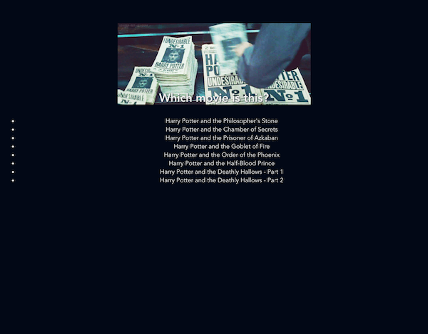

## Step 4: Displaying possible movie options

So far we have displayed the list with answers, including all the movies that exist.
But what we want is to provide some suggestions to the user and let them guess which one of these answers is the correct one.

To achieve this, we'll use some buttons. Once one of them is clicked, it turns green if the answer is correct or red if the answer is incorrect.

_Here in step 4, we are changing from presenting all available movies to only a list of 4, where the user can make her choice, by clicking on it.
In step 5, we will include the evaluation when the user clicks on a button if the answer was correct or wrong._

We need to change the data used to iterate and employ the data of the current question. We're going to use a computed property again, which returns the possible answers from the current question.

Edit **Quiz.vue**'s `ul` tag:

```html
<!--Quiz.vue -->
<ul class="quiz-choices" v-if="stage==='quiz'">
      <li v-for="answerNumber in answers" :key="answerNumber">
            <button class="quiz-button">{{ movies[answerNumber] }}</button>
      </li>
</ul>
```
And add a new computed property to the growing list:

```javascript
// Quiz.vue
answers() {
      return this.currentQuestionNumber
            ? this.questions[this.currentQuestionNumber - 1].answers
            : [];

      /*
        Learn about ternary operators here:
        - https://developer.mozilla.org/en-US/docs/Web/JavaScript/Reference/Operators/Conditional_Operator
      */
}
```
Finally, add a few more styles to make the buttons appear without bullet points:

```
.quiz-choices li {
  list-style: none;
  margin: 0.5em;
}
```

### Achievement

At the end of step 4, after starting the Quiz, your screen should contain the first question and the options to choose:

**After clicking on the start button:**

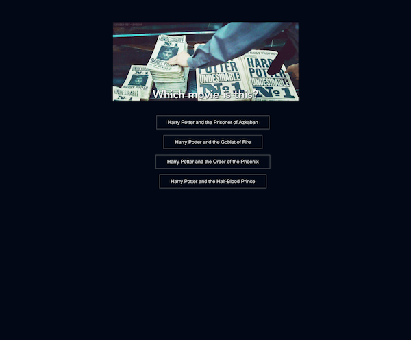

## Step 5: Evaluate the option that was clicked

Now that we offered the user all possible quiz answers, we need to add a click event listener to the options buttons and evaluate if the correct choice was made by the user.

Define two more methods to evaluate the choice and handle the answer.

Edit the button in **Quiz.vue**:

```html
<!-- Quiz.vue --->
<button
  @click="handleAnswer(answerNumber)"
  class="quiz-button"
  :class="{
    'correct': isCorrectAnswer(answerNumber) && currentUserAnswer === answerNumber,
    'wrong': !isCorrectAnswer(answerNumber) && currentUserAnswer === answerNumber
  }">
  {{ movies[answerNumber - 1] }}
</button>
```
Add logic in `data` to clear the current answers, determine the correct answer, and handle it. Don't forget to add commas to prior elements when adding new ones:

```javascript
// Quiz.vue
data() {
  return {
    // ...
    currentUserAnswer: null
}
// ...
methods: {
// ...
  isCorrectAnswer(answerNumber) {
    return (
      this.currentUserAnswer &&
      answerNumber === this.questions[this.currentQuestionNumber - 1].correct
    );
  },
  handleAnswer(answerNumber) {
    this.currentUserAnswer = answerNumber;
  }
// ...
}
```

Don't forget to enhance the button style for the incorrect and correct answer. Otherwise you won't see any changes in the browser. Tip: refresh your browser if you don't see these changes, ensuring that you've saved your work first!

```css
.quiz-button.wrong {
  background-color: red;
}
.quiz-button.correct {
  background-color: green;
}
```

### Achievement

At the end of step 5, you can click on the button and it should turn green or red whether your answer was correct or not.

**Correct answer:**

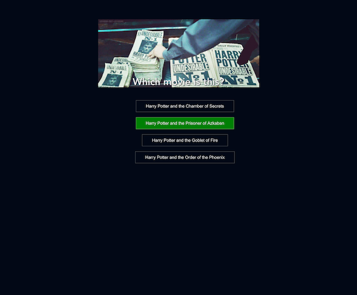

**Wrong answer:**

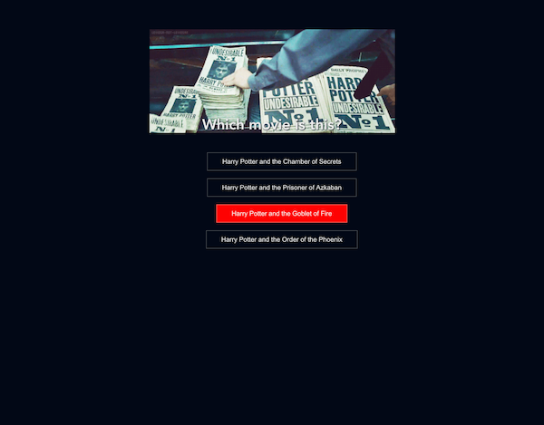

## Step 6: Proceed with next question

After evaluating the answer we'll show the result to the user for a short time and then follow up with the next question.

To wait for a second after the evaluation, we'll need to create a `setTimeout` function indicating the amount of waiting in milliseconds. E.g. 1 second = 1000 milliseconds.

And to display the next question we'll need to increase the `currentQuestionNumber` by one.

Because Vue recognizes changes in the component's data, these additions will update all dependencies, and the values in the component will be updated by showing the next question to the user.

Additionally, we should store the given answer in an array, which we'll use to calculate the user's score at the end of the quiz. To do this, add another variable inside data, which will hold all given answers.

In **Quiz.vue** add an empty array for the user's answers:

```javascript
data() {
  return {
    ...
    userAnswers: []
  }
}
```

Add methods to enhance the ability to handle answers and move to the next question:

```javascript
<!-- Quiz.vue --->
handleAnswer(answerNumber) {
    this.currentUserAnswer = answerNumber;
    this.userAnswers.push(answerNumber);

    setTimeout(() => {
        this.nextQuestion();
    }, 1000);
},
nextQuestion() {
    this.currentUserAnswer = null;
    ++this.currentQuestionNumber;
}
```

::: tip 💡
Learn about setTimeout functions here: [https://developer.mozilla.org/en-US/docs/Web/API/WindowOrWorkerGlobalScope/setTimeout](https://developer.mozilla.org/en-US/docs/Web/API/WindowOrWorkerGlobalScope/setTimeout). In this area we are also increating a variable by one with an unary operator: `++this.currentQuestionNumber`. That line of line of code is equal to this: `this.currentQuestionNumber = this.currentQuestionNumber + 1` or `this.currentQuestionNumber += 1`. 

Learn about expressions and operators here: [https://developer.mozilla.org/en-US/docs/Web/JavaScript/Guide/Expressions_and_Operators](https://developer.mozilla.org/en-US/docs/Web/JavaScript/Guide/Expressions_and_Operators)
:::

### Achievement

At the end of step 6, a user can answer all questions. Every time she makes a choice, the application forwards to the next question after a short time.


## Step 7: Introducing usage of store and saving data in local storage

Maybe you've realized that every time you're making changes in your code or you do a refresh in the preview, the state has gone away and you have to start the quiz from the beginning.

Currently, we're not storing our data, so we can’t load information about the current question for the user to answer, or what answers the user has given so far.

To change this and improve saving our data, we're going to use local Storage and state management in Vue. This will help us to mutate (change) data and state in our app.

State management becomes really useful for larger apps. Apps can often grow in complexity, due to multiple pieces of state scattered across many components and interactions between them. State management serves as a centralized store for all the components in an app, with rules ensuring that the state can only be mutated (changed) in a predictable fashion. The convention is that components are never allowed to directly mutate (change) state that belongs to the store, but should instead dispatch events that notify the store to perform actions.

We're going to use a lightweight implementation of state management in Vue.js, which is done with observables. This is a function that returns a reactive instance of a given object.

::: tip 💡
You can read more about Vue Observables here: [https://vuejs.org/v2/api/#Vue-observable](https://vuejs.org/v2/api/#Vue-observable)
:::

The following is the data we want to handle via the store:
- questions
- currentQuestion
  - img
  - correct
  - answers
- userAnswers
- ...

First, we're defining the store with Vue observables which expects an object with all properties we want to observe.

Create a folder called "store" in the root of your app and inside it, a file called "index.js" with the following content:

```javascript
// store/index.js
import Vue from "vue";


export const store = Vue.observable({
  questions: [],
  stage: null,
  title: null,
  currentQuestion: {
    img: null,
    correct: null,
    answers: []
  },
  currentQuestionNumber: null,
  userAnswers: []
});
```

To change our values in the store we have to use a defined way for it, and do it over a set of methods, which are defined within the mutation property.

Therefore, we have to define further each property inside the store as a set method if we want to mutate those values.

We'll also store the data in the `localStorage` of the browser.

::: tip 💡
You can read more about window local storage here: [https://developer.mozilla.org/en-US/docs/Web/API/Web_Storage_API/Local_storage](https://developer.mozilla.org/en-US/docs/Web/API/Web_Storage_API/Local_storage)
:::

In this file, create your mutations by adding this block under the block you pasted in above:

```javascript
// store/index.js
// ...
export const mutations = {
  setStage(stage) {
    store.stage = stage;
    localStorage.stage = stage;
  },
  setQuestions(questions) {
    store.questions = questions;
  },
  setTitle(title) {
    store.title = title;
  },
  setCurrentQuestion(questionNumber) {
    store.currentQuestionNumber = questionNumber;
    store.currentQuestion = { ...store.questions[questionNumber - 1] };
    localStorage.currentQuestionNumber = questionNumber;
  },
  addUserAnswer(userAnswer) {
    store.userAnswers.push(userAnswer);
    localStorage.userAnswers = JSON.stringify(store.userAnswers);
  },
  setUserAnswers(userAnswers) {
    store.userAnswers = userAnswers;
    localStorage.userAnswers = JSON.stringify(store.userAnswers);
  },
  resetUserAnswers() {
    store.userAnswers = [];
    localStorage.userAnswers = JSON.stringify([]);
  }
};
```

As we're using a store now, it makes sense to move the fetching of data away from the Quiz component to the store.

Fetching the data is an action, and it's defined within the action object of the store. Also in this action, we're handling the loading of stored data from the localStorage.

In your storage file, create an actions block under the previous mutations block:

```javascript
// store/index.js
// ...
export const actions = {
  async fetchData(url) {
    let res = await fetch(url);
    res = await res.json();
    mutations.setQuestions(res.questions);
    mutations.setStage(localStorage.stage || "welcome");

    const number = Number(localStorage.currentQuestionNumber) || null;
    mutations.setCurrentQuestion(number);

    const answers = localStorage.userAnswers
      ? JSON.parse(localStorage.userAnswers)
      : [];

    mutations.setUserAnswers(answers);
  }
};
```

Now that we defined our store and can use it to fetch, store, and mutate data, we need to use it from the components side.

### Refactor to handle the store

First, replace the contents of the mounted function in the **Quiz.vue** with the action `fetchData()` from the store.

Secondly, extract the initialization of the quiz stage depending on which one is active.

Although we're going to store data, we have to do some additional work for the initialization at the beginning, and maybe if we want to play the quiz again from the beginning.

So add two additional methods into the mounted lifecycle hook: `initWelcomeStage()` and `initQuizStage()`. Later on we'll need a third one for the score stage.

```html
<!-- Quiz.vue -->
<!-- ... --->
<script>
import { mutations, store, actions } from "../store";
async mounted() {
    await actions.fetchData(this.questionsUrl);
     if (store.stage === "welcome") {
      this.initWelcomeStage();
    } else if (store.stage === "quiz") {
      this.initQuizStage();
    }
}
// ...
</script>
```

After this, we want to use all data from the store.
Therefore, we have to edit the computed properties for `image()`, `title()` and `answers()`.

::: tip 💡
You can read more about Vue computed properties here: [https://vuejs.org/v2/guide/computed.html#Basic-Example](https://vuejs.org/v2/guide/computed.html#Basic-Example)
:::

Edit the computed properties:

```javascript
// Quiz.vue
import { mutations, store, actions } from "../store";
// ...
computed: {
    image() {
      return store.stage === "quiz"
        ? store.currentQuestion.img
        : "https://media0.giphy.com/media/Bh3YfliwBZNwk/giphy.gif?cid=3640f6095c852266776c6f746fb2fc67";
    },
    title() {
      return store.title;
    },
    answers() {
      return store.currentQuestion.answers ?
        store.currentQuestion.answers
        : [];
    },
  },
```

Within the template where we check if the welcome stage has to be shown or the quiz started with the questions, we're using the `stage` for evaluation. But the `stage` is now part of the store, and before looking up `stage` in the store we would have to check if the store has initialized. To avoid this, edit `stage`, to avoid being forced to check if the store can be used so far.

```javascript
// Quiz.vue
computed: {
  // ...
  stage() {
      return store.stage;
  }
  // ...
}
```
Edit the quiz's initial button as well to add the v-if test to display properly:

```html
<!-- Quiz.vue -->
<button class="quiz-button" v-if="stage === 'welcome'" @click="initQuizStage">Start Quiz</button>
<ul class="quiz-choices" v-else-if="stage === 'quiz'">...</ul>
```

If the user makes a choice, we have to change some values in the store to continue with the next question, and to save all answers the user gave us until this point.

We'll need to do this in a defined way and use the mutation methods from the store.

We also have to import the mutations from the store, so edit the methods block to use these mutations:

```javascript
// Quiz.vue
import { store, actions, mutations } from "../store";
  methods: {
    initWelcomeStage() {
      mutations.setStage("welcome");
      mutations.resetUserAnswers();
      mutations.setCurrentQuestion(null);
      mutations.setTitle("How Well Do You Know the Harry Potter Movies?");
    },
    initQuizStage() {
      mutations.setStage("quiz");
      mutations.setCurrentQuestion(+store.currentQuestionNumber || 1);
      mutations.setTitle("Which movie is this?");
    },
    isCorrectAnswer(answerNumber) {
      return this.currentUserAnswer && answerNumber === store.currentQuestion.correct;
    },
    handleAnswer(answerNumber) {
      this.currentUserAnswer = answerNumber;
      mutations.addUserAnswer(answerNumber);

      setTimeout(() => {
        this.nextQuestion();
      }, 1000);
    },
    nextQuestion() {
      this.currentUserAnswer = null;
      mutations.setCurrentQuestion(store.currentQuestionNumber + 1);
    }
  }
    //...
```

**Hint:**
In CodeSandbox we're running into a problem when using `localStorage`. This is because of the iframes needed by CodeSandbox. To get our QuizApp running again, we need to open the view in a new browser window.

### Achievement

At the end of step 7, a user can refresh the page and the question, that was asked last time and has not yet been answered by the user will be loaded.

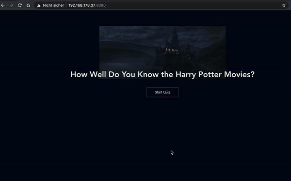

## Step 8: Create the score view

When all questions are answered and the user arrives at the end of the quiz, we want to show them their score.

We already prepared some text which is displayed to the user with their score achieved.

We're enhancing the App.vue with the `resultsInfo` data which is provided to the **Quiz.vue** as property. Edit the child component:

```html
<!-- App.vue -->
<quiz
      :movies="movies"
      :resultsInfo="resultsInfo"
      questions-url="https://api.jsonbin.io/b/5cdd1762dbffad51f8aa85a5"
/>
```
And enhance the data method to **App.vue**, adding a comma under the movies array:

```javascript
// App.vue
data() {
  return {
    // ...
    resultsInfo: {
      0: {
        text: "Practice, practice, practice! <br>You'll be a clever as Dumbledore in no time!",
        img: "https://media0.giphy.com/media/720g7C1jz13wI/giphy.gif?cid=3640f6095c869951776a4a7a5110b5dc"
      },
      1: {
        text: "You still have to practice!",
        img: "https://media0.giphy.com/media/720g7C1jz13wI/giphy.gif?cid=3640f6095c869951776a4a7a5110b5dc"
      },
      2: {
        text: "Not too shabby! <br>Have a Harry Potter movie marathon and then try again!",
        img: "https://media2.giphy.com/media/UeeJAeey9GJjO/giphy.gif?cid=3640f6095c869e703631634241b759c1"
      },
      3: {
        text: "Very good! <br>Have another go and you'll be getting full marks!",
        img: "https://media.giphy.com/media/TGLLaCKWwxUVq/giphy.gif"
      },
      4: {
        text: "TOP MARKS! Nice work! <br>You have some serious wizard wisdom!",
        img: "https://media.giphy.com/media/9H279yb0blggo/giphy.gif"
      }
    }
  }
};
```

When the quiz is complete, we have to switch from the `quiz stage` to the `result stage`. To do this, we'll define a method for it.

We have to consider when a refresh by the user is done and the application needs to initialize again when the component is mounted.

Edit the mounted hook in **Quiz.vue**, and add a computed method and a method, adding commas where needed:

```javascript
  // ...
  async mounted() {
    await actions.fetchData(this.questionsUrl);
    if (store.stage === "result") {
      this.initResultStage();
    } else if (store.stage === "quiz") {
      this.initQuizStage();
    } else {
      this.initWelcomeStage();
    }
  },
  computed: {
    // ...
    result() {
      const correctAnswers = this.correctAnswers();
      const resultInfo = this.resultsInfo[Math.floor(correctAnswers / 5)];
      const result = {
        title: `Your Score: ${correctAnswers} out of ${
          store.questions.length
        }`,
        ...resultInfo
      };

      return result;
    }
    // ...
  }
  methods: {
    // ...
    initResultStage() {
      mutations.setStage("result");
      mutations.setTitle(this.result.title);
    }
    // ...
  }
  // ...
```

When switching to the next question, we additionally have to check if the user has arrived at the end of the quiz. If so, we have to change the stage.

Edit the handleAnswer's setTimeout method in **Quiz.vue**:

```javascript
// ...
handleAnswer(answerNumber) {
  // ...
  setTimeout(() => {
      if (store.currentQuestionNumber < store.questions.length) {
        this.nextQuestion();
      } else {
        this.initResultStage();
      }
  }, 1000);
  // ...
}
```

In the **Quiz.vue** we have to define the new property for our user's result.

```javascript

// Quiz.vue
props: {
  // ....
  resultsInfo: {
    type: Object,
    required: true
  }
},
```

First, we're going to calculate the correct answers the user gave, so add a computed property:

```javascript
// Quiz.vue
correctAnswers() {
  let count = 0;
  store.questions.forEach((q, i) => {
    if (q.correct === store.userAnswers[i]) {
      count++;
    }
  });
  return count;
},
```

Now we have to evaluate which result info has to be shown to the user.
Add the detailed result text in an extra element and a button to restart the quiz, only shown if the user is on the result's page.

Add this at the bottom of the template in **Quiz.vue** before the div's closing tag:

```html
<p v-if="this.stage === 'result'" v-html="this.result.text"/>
<button class="wellcome-button" v-if="stage === 'result'" @click="initWelcomeStage">Start again</button>
```

Maybe you also don't want to keep the last quiz question's image.
If not, enhance the `image()` computed property and check if the stage is result.

```javascript
// ...
image() {
  switch (store.stage) {
    case "result":
      return this.result.img;
    case "quiz":
      return store.currentQuestion.img;
    default:
      return "https://media0.giphy.com/media/Bh3YfliwBZNwk/giphy.gif?cid=3640f6095c852266776c6f746fb2fc67";
  }
}
// ...
```

### Achievement

That's it!

You've completed your very first Harry Potter movie quiz app with Vue.js!

**Well done :)**

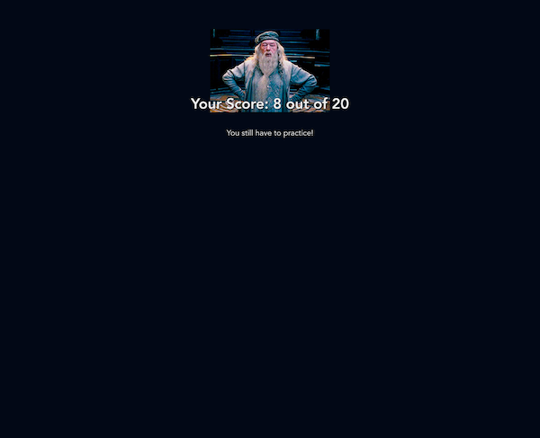


## Author

Made with ❤️ by Mary Vokicic with support from Ilithya and Steffanie Stoppel
